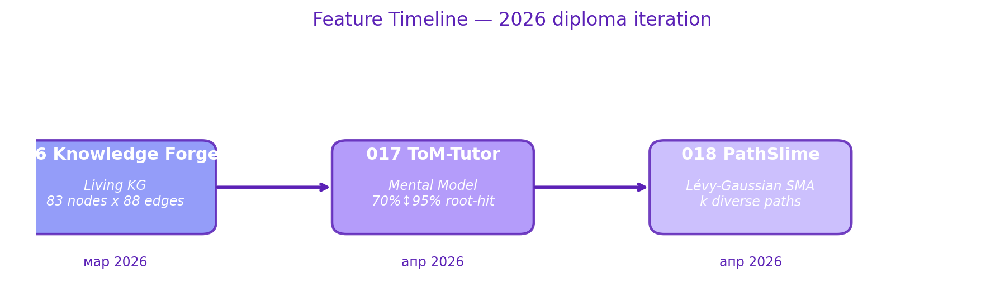
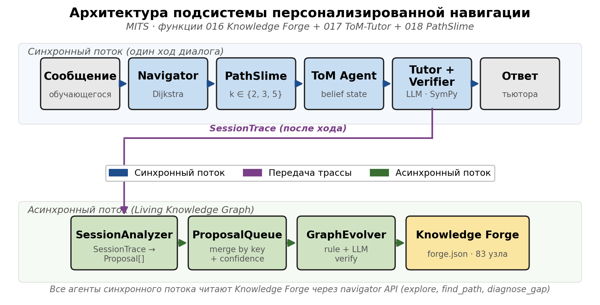
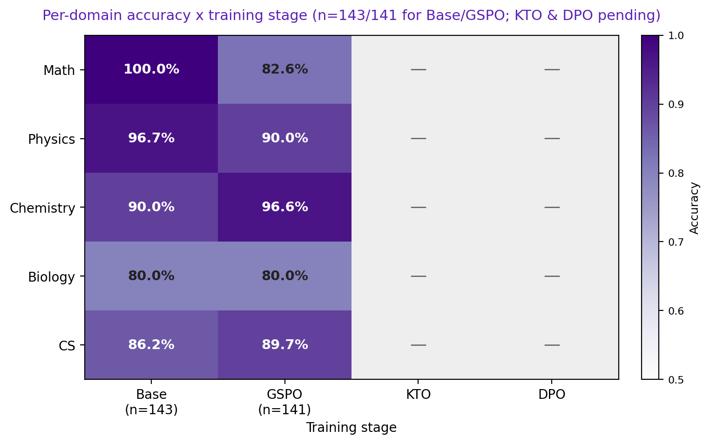

<div align="center">

<!-- Banner -->


# 🔮 MITS — Math Intelligent Tutoring System

*«Магия — это не талант. Это терпение, практика и правильный наставник.»*

**Интеллектуальная система обучения STEM-дисциплинам с сократическим методом,
мультиагентной архитектурой и RL-обученной языковой моделью**

[](https://python.org)
[](https://huggingface.co/Siesher)
[](https://nextjs.org)
[](https://fastapi.tiangolo.com)
[](LICENSE)

[Демо](#быстрый-старт) · [Архитектура](#архитектура) · [Training Pipeline](#training-pipeline) · [Evaluation](#evaluation) · [Документация](docs/INDEX.md)

</div>

---

## О проекте

MITS — система, которая учит решать, а не даёт ответы. Как наставник, собравший тысячи «заклинаний» — методов, задач, подходов — она ведёт студента через сократический диалог: задаёт вопросы, даёт подсказки, проверяет решения символьно.

<table>
<tr>
<td width="50%">

**Пять доменов**
- 📐 Математика (алгебра, анализ, геометрия)
- ⚛️ Физика (механика, термодинамика, электричество)
- 🧪 Химия (неорганика, органика, аналитика)
- 🧬 Биология (молекулярная, генетика, экология)
- 💻 Информатика (алгоритмы, структуры данных)

</td>
<td width="50%">

**Ключевые особенности**
- Сократический метод — никогда не даёт готовых ответов
- Мультиагентная архитектура (Profiler → Planner → Tutor → Verifier)
- Символьная верификация (SymPy / ChemPy)
- Knowledge Tracing (BKT + DKT) — 40+ навыков
- Fine-tuned Qwen3.5-9B через 3-стадийный RL
- OCR рукописных решений (Qwen2.5-VL)

</td>
</tr>
</table>

---

## ✨ Ключевые фичи 2026

<div align="center">



</div>

| Feature | Что делает | Ключевая метрика | Spec |
|:---|:---|:---|:---|
| **016 Knowledge Forge** | Живой граф знаний: 83 узла × 88 рёбер, 6 типов узлов × 10 типов рёбер, self-completion из сессий | Path validity 100% · Frontier violation 0% | [specs/016](specs/016-knowledge-forge/) |
| **017 ToM-Tutor** | Theory-of-Mind агент: моделирует пробелы и заблуждения студента, re-rank навигатора | Root-hit 70% → **95%** · 0 регрессий на 20 сценариях | [specs/017](specs/017-tom-tutor/) |
| **018 PathSlime** | Lévy-Gaussian SMA: k разных траекторий обучения, bio-inspired diversity | 3 diverse paths (k=3, α=1.5) | [specs/018](specs/018-path-slime/) |

---

## Архитектура

<div align="center">



</div>

<details>
<summary>ASCII-fallback диаграмма архитектуры</summary>

```
                    ┌─────────────────────────────────────────────┐
                    │         Next.js 14 + TypeScript              │
                    │    Tailwind · shadcn/ui · Zustand · WS       │
                    └──────────────────┬──────────────────────────┘
                                       │ REST + WebSocket (streaming)
                    ┌──────────────────▼──────────────────────────┐
                    │              FastAPI Backend                  │
                    │     JWT Auth · Sessions · Analytics · PDF     │
                    └──────────────────┬──────────────────────────┘
                                       │
    ┌──────────────────────────────────▼──────────────────────────────────┐
    │                     Multi-Agent Orchestrator                        │
    │                                                                     │
    │   ┌──────────┐    ┌──────────┐    ┌──────────────┐    ┌──────────┐ │
    │   │ Profiler  │ →  │ Planner  │ →  │    Tutor     │ →  │ Verifier │ │
    │   │ (уровень  │    │ (стратег │    │ (сократичес- │    │ (SymPy/  │ │
    │   │  ученика) │    │  урока)  │    │ кий диалог)  │    │ ChemPy)  │ │
    │   └──────────┘    └──────────┘    └──────────────┘    └──────────┘ │
    │                                                                     │
    │   ┌──────────┐    ┌──────────┐    ┌──────────────┐                 │
    │   │   RAG    │    │ Knowledge│    │  Few-Shot     │                 │
    │   │(ChromaDB)│    │ Tracing  │    │  Bank (SKI)   │                 │
    │   └──────────┘    └──────────┘    └──────────────┘                 │
    └──────────────────────────────┬──────────────────────────────────────┘
                                   │
                    ┌──────────────▼──────────────────────────┐
                    │     Ollama · Qwen3.5-9B (fine-tuned)    │
                    │        Token-by-token streaming          │
                    └─────────────────────────────────────────┘
```

</details>

**Три режима работы:**

| Режим | Описание |
|:------|:---------|
| 💬 **Chat** | Свободный диалог с STEM-репетитором |
| 📚 **Guided Learning** | Полный пайплайн агентов: Profiler → Planner → Tutor → Verifier |
| 🎯 **Task Generator** | Генерация задач по теме, сложности и навыку |

---

## Training Pipeline

Модель Qwen3.5-9B дообучается 3-стадийным RL-пайплайном на Google Colab A100 80GB (bf16, без квантизации при обучении):

```
    Qwen3.5-9B-Instruct
            │
            ▼
    ╔═══════════════════╗
    ║   Stage 1: GSPO   ║  Group Sequence Policy Optimization
    ║                   ║  Triple GDPO reward: correctness (0.7)
    ║   curriculum RL   ║  + format (0.15) + Socratic (0.15)
    ╚════════╤══════════╝
             ▼
    ╔═══════════════════╗
    ║   Stage 2: KTO    ║  Kahneman-Tversky Optimization
    ║                   ║  Unpaired preferences from
    ║ Socratic align.   ║  dialogues + preference pairs
    ╚════════╤══════════╝
             ▼
    ╔═══════════════════╗
    ║   Stage 3: DPO    ║  Direct Preference Optimization
    ║                   ║  Final format and style
    ║   format polish   ║  alignment polish
    ╚════════╤══════════╝
             ▼
       Fine-tuned model
       (Ollama / GGUF)
```

| Stage | Notebook | HF Repo | Technique |
|:------|:---------|:--------|:----------|
| GSPO | `grpo_qwen3.5_9b.ipynb` | [mits-qwen3-9b-gspo](https://huggingface.co/Siesher/mits-qwen3-9b-gspo) | Triple GDPO reward (correctness + format + Socratic) |
| KTO | `kto_qwen3.5_9b.ipynb` | [mits-qwen3-9b-kto](https://huggingface.co/Siesher/mits-qwen3-9b-kto) | Kahneman-Tversky Optimization ([arXiv 2402.01306](https://arxiv.org/abs/2402.01306)) |
| DPO | `dpo_polish_qwen3.5_9b.ipynb` | [mits-qwen3-9b-final](https://huggingface.co/Siesher/mits-qwen3-9b-final) | Direct Preference Optimization |

**Данные:**
- `data/training/dialogs.jsonl` — 3 875 сократических диалогов
- `training/data/preference_pairs.jsonl` — 12 597 пар предпочтений
- Evaluation benchmark — 3 678 задач (MGSM Russian + ruMMLU STEM + custom)

---

## 📊 Результаты обучения

<div align="center">



</div>

**Accuracy по доменам** (стратифицированный subset n=143, локальный бенчмарк):

| Domain | Base | GSPO | KTO | DPO |
|:---|:---:|:---:|:---:|:---:|
| Math | 100.0% | 82.6% | — | — |
| Physics | 96.7% | 90.0% | — | — |
| Chemistry | 90.0% | 96.6% | — | — |
| Biology | 80.0% | 80.0% | — | — |
| CS | 86.2% | 89.7% | — | — |
| **Overall** | **90.2%** | **87.9%** | — | — |

> ⚠️ **Small sample honesty.** 143-задачный subset, single run. GSPO показывает
> mixed effects: снижение на math (100% → 82.6%), но прирост на chemistry
> (+6.6%) и CS (+3.5%). Full-benchmark eval (n=3678) и стадии KTO/DPO —
> в работе. Источник: `evaluation/reports/compare_base_vs_gspo_20260331_115146.json`.

### 📈 ToM-Tutor A/B evaluation

| Метрика | Baseline | ToM | Delta |
|:---|:---:|:---:|:---:|
| Root-hit rate | 70.0% | **95.0%** | **+25.0%** |
| Any-hit rate | 100.0% | 100.0% | ±0 |
| Misconception accuracy | — | 90.0% | — |
| Regressed scenarios | — | 0 / 20 | — |
| Avg confidence | — | 0.89 | — |

*20 сценариев в 4 категориях (explicit_misconception, confused, open_question,
confident_wrong). Latency p50 11.5 s, p95 147 s — узкое место.
Источник: `evaluation/reports/tom_ab_2026-04-18.md`.*

### 📉 Knowledge Forge baseline

| Метрика | Value |
|:---|:---:|
| Gap Diagnosis (root-hit) | 60.0% (5 сценариев) |
| Gap Diagnosis (any-hit) | 100.0% |
| Frontier Violation Rate | 0.0% (lower = better) |
| Path Validity (invalid-pair rate) | 0.0% (7 пар) |
| Graph growth | 83 → 83 узлов, 88 → 88 рёбер (1 rejected) |

*Источник: `evaluation/reports/baseline_2026-04-18.md`.*

---

## Evaluation

Бенчмарк из 3 678 задач по 5 доменам × 3 уровням сложности.
Стратифицированная выборка 200 задач для быстрых per-stage оценок.

```bash
# Запуск оценки стадии
python training/scripts/evaluate_stage.py run --stage gspo --model mits-tutor-9b-gspo --workers 4

# Сравнение стадий
python training/scripts/evaluate_stage.py compare --reports evaluation/reports/
```

Отчёты сохраняются в `evaluation/reports/` как JSON с разбивкой по домену и сложности.

---

## Быстрый старт

### Требования
- Python 3.11+ · Node.js 18+ · [Ollama](https://ollama.ai)

### Установка

```bash
git clone https://github.com/Siesher/MITS.git
cd MITS

# Backend
python -m venv venv
source venv/bin/activate        # Linux / Mac
# .\venv\Scripts\Activate.ps1  # Windows
pip install -r requirements.txt

# Frontend
cd frontend && npm install && cd ..
```

### Модель

```bash
ollama serve
ollama pull qwen3.5:9b                         # базовая модель
# ollama create mits-tutor -f training/Modelfile  # fine-tuned версия
```

### Запуск

```bash
# Backend (порт 8000)
cd backend && uvicorn app.main:app --reload --host 0.0.0.0 --port 8000

# Frontend (порт 3000)
cd frontend && npm run dev
```

→ **http://localhost:3000**

---

## Структура проекта

```
MITS/
├── frontend/                    # Next.js 14 + TypeScript
│   ├── src/app/                 #   Pages (auth, chat, dashboard)
│   ├── src/components/          #   React-компоненты
│   ├── src/hooks/               #   useChat, useWebSocket
│   └── src/store/               #   Zustand (chatStore)
│
├── backend/                     # FastAPI
│   ├── app/api/v1/              #   REST + WebSocket endpoints
│   ├── app/services/            #   Orchestrator, analytics, export
│   └── app/models/              #   SQLAlchemy ORM
│
├── src/                         # Core Python — агенты и модели
│   ├── agents/                  #   Profiler, Planner, Tutor, Verifier
│   ├── models/                  #   LLM client, KT, detectors, prompts
│   ├── knowledge/               #   RAG, SKI, few-shot bank
│   ├── tools/                   #   SKI tool adapters
│   └── execution/               #   Code sandbox + AST analyzer
│
├── training/                    # ML training pipeline
│   ├── scripts/                 #   evaluate_stage, stem_rewards, export
│   ├── data/                    #   Datasets, benchmark
│   └── Modelfile*               #   Ollama templates (9b GSPO/KTO)
│
├── notebooks/                   # Colab training notebooks
│   ├── grpo_qwen3.5_9b.ipynb    #   Stage 1: GSPO
│   ├── kto_qwen3.5_9b.ipynb     #   Stage 2: KTO
│   ├── dpo_polish_qwen3.5_9b.ipynb  # Stage 3: DPO
│   └── archive/                 #   Legacy (Qwen3-4B, GLM)
│
├── evaluation/                  # Reports + benchmarks
├── data/                        # Knowledge bases (forge.json, RAG, skills)
│
├── docs/
│   ├── diploma/                 #   НИР 2026 + Курсовой 2026 (+ PDF exports)
│   ├── architecture/            #   ARCHITECTURE, MODEL_SELECTION, ...
│   ├── training/                #   TRAINING_PIPELINE, GSPO_TECHNIQUES
│   ├── guides/                  #   quickstart, PROJECT_STATUS
│   └── archive/                 #   pre-2026, nir-drafts
│
├── scripts/
│   ├── db/                      #   init_db, migrate_to_forge
│   ├── knowledge/               #   grow_graph, ingest_pdf, embeddings
│   ├── ollama/                  #   TurboQuant + Ollama automation
│   ├── design/                  #   design handoff, social preview
│   └── diploma/                 #   one-shot diploma generators (already ran)
│
├── figures/
│   ├── diploma/                 #   Figures for НИР + Курсовой
│   └── readme/                  #   feature_timeline, domain_heatmap
│
├── specs/                       # 001–018 feature specs
└── tests/                       # Unit & integration
```

---

## Технологии

| Layer | Stack |
|:------|:------|
| **Frontend** | Next.js 14 · TypeScript · Tailwind CSS · shadcn/ui · Zustand |
| **Backend** | FastAPI · SQLAlchemy · SQLite · Alembic · JWT (PyJWT + Argon2) |
| **LLM** | Ollama · Qwen3.5-9B (fine-tuned) · WebSocket streaming |
| **ML Training** | Unsloth · TRL (GRPOTrainer, KTOTrainer, DPOTrainer) · PEFT · Transformers |
| **Evaluation** | SymPy · ChemPy · 3 678-problem benchmark |
| **Knowledge** | ChromaDB · sentence-transformers · BKT · DKT |
| **Deploy** | Docker Compose |

---

## ❓ FAQ / Troubleshooting

<details>
<summary><b>Модель долго грузится / отвечает.</b></summary>

Используй профили из `src/resource_profiles.py` (`lite` / `standard` / `max`) —
они подбирают `num_ctx` и `num_predict` под железо. TurboQuant KV compression
ускоряет inference в 1.7–2× на RTX 4090. Подробнее:
[docs/architecture/RESOURCE_PROFILES.md](docs/architecture/RESOURCE_PROFILES.md).

</details>

<details>
<summary><b>/health endpoint таймаутит.</b></summary>

В `backend/app/services/orchestrator_service.py` включён 30-секундный TTL-cache
на `_check_llm_available()`. Если всё равно медленно — проверь, что Ollama
запущена (`ollama ps`) и модель подтянута (`ollama list`).

</details>

<details>
<summary><b>Ollama падает при inference или OOM.</b></summary>

Запусти `scripts/ollama/optimize_ollama.ps1` — он применяет safe defaults
для num_ctx / num_gpu / num_thread. Для моделей ≥17 GB single-shard
`ollama create --quantize` может зависнуть — используй `scripts/ollama/activate_turbo_quant.ps1` вместо этого.

</details>

<details>
<summary><b>Word lock files (<code>~$*.docx</code>) в docs/diploma/.</b></summary>

```powershell
Get-Process WINWORD -ErrorAction SilentlyContinue | Stop-Process -Force
Remove-Item docs/diploma/~$*.docx -Force
```

</details>

<details>
<summary><b>Frontend не подключается к backend по WebSocket.</b></summary>

Проверь:
1. Backend запущен на порту 8000 (`cd backend && uvicorn app.main:app --reload --port 8000`)
2. В `.env` переменная `NEXT_PUBLIC_WS_URL=ws://localhost:8000/api/v1/ws`
3. JWT токен не истёк (в dev-режиме срок жизни = 24 часа)

</details>

---

## Дорожная карта

<details>
<summary><b>Курсовая работа (2024)</b></summary>

- [x] Code Executor с песочницей
- [x] 50+ алгоритмических задач с автопроверкой
- [x] AST-анализатор кода
- [x] Gradio UI

</details>

<details>
<summary><b>Дипломная работа (2025–2026)</b> — текущий этап</summary>

- [x] Next.js 14 + FastAPI миграция
- [x] JWT аутентификация + session persistence
- [x] Три режима чата (chat, guided learning, task generator)
- [x] DKT knowledge tracing
- [x] RuBERT эмоциональный детектор
- [x] OCR рукописных решений (Qwen2.5-VL)
- [x] A/B experiment framework
- [x] Analytics dashboard + PDF экспорт
- [x] Docker Compose deployment
- [x] Миграция на Qwen3.5-9B (bf16, A100 80GB)
- [x] 3-стадийный RL pipeline (GSPO → KTO → DPO)
- [x] Evaluation benchmark (3 678 задач)
- [x] Structured Knowledge Index (SKI) + tool calling
- [ ] Textbook grounding (method cards, problem templates)
- [ ] Per-stage evaluation → hyperparameter refinement

</details>

---

## Научная основа

<details>
<summary>Ключевые статьи и методы</summary>

| Метод | Paper | Применение в MITS |
|:------|:------|:-------------------|
| GRPO | [DeepSeek-Math](https://arxiv.org/abs/2402.03300) | Основа GSPO — group-relative advantage estimation |
| GDPO | [arXiv 2601.05242](https://arxiv.org/abs/2601.05242) | Decoupled multi-objective rewards |
| KTO | [arXiv 2402.01306](https://arxiv.org/abs/2402.01306) | Kahneman-Tversky loss для Socratic alignment |
| DPO | [arXiv 2305.18290](https://arxiv.org/abs/2305.18290) | Format polish без reward model |
| BKT | Corbett & Anderson, 1994 | Bayesian Knowledge Tracing |
| DKT | [arXiv 1506.05908](https://arxiv.org/abs/1506.05908) | Deep Knowledge Tracing |
| Socratic Method | [Chi et al., 2001](https://doi.org/10.1207/s15516709cog2505_1) | Scaffolding, hinting, never telling |

</details>

---

## Лицензия

[MIT License](LICENSE) — свободно используйте, форкайте, дорабатывайте.

---

<div align="center">

*Каждый решённый пример — это заклинание, добавленное в гримуар.*
*Каждая ошибка — шаг к мастерству.*

**Сухацкий Максим** · МГТУ им. Н.Э. Баумана (Калужский филиал) · 2024–2026

[](https://huggingface.co/Siesher)
[](https://github.com/Siesher)

</div>
