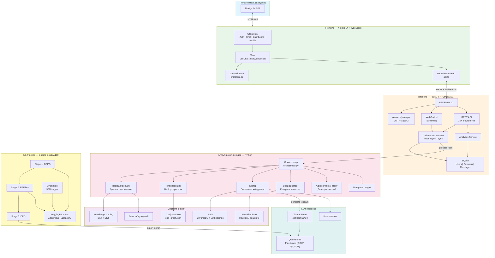
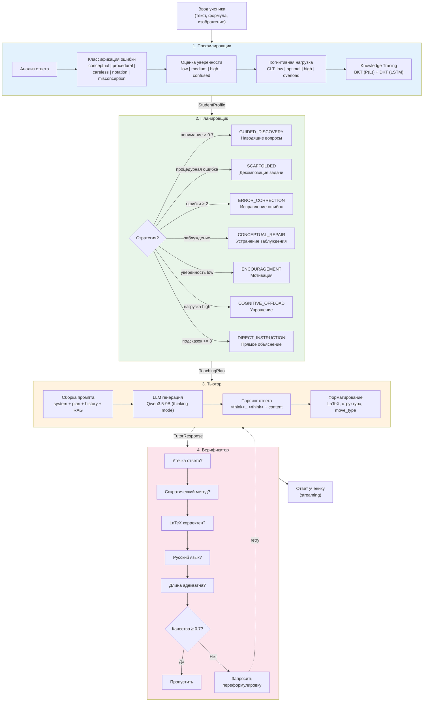
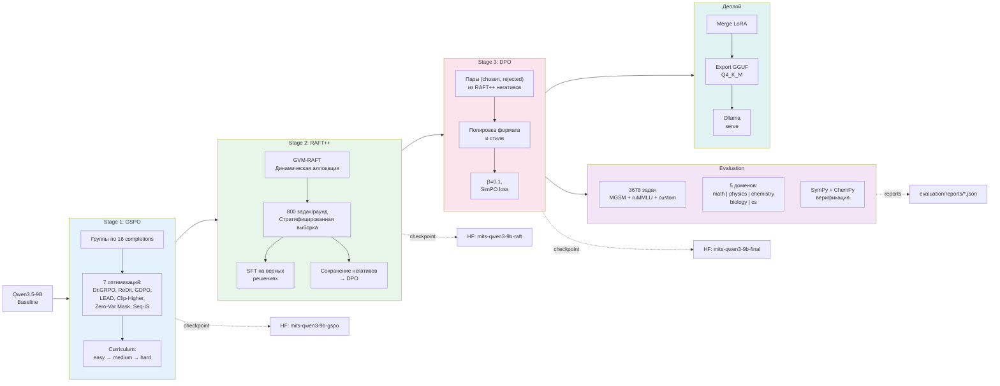
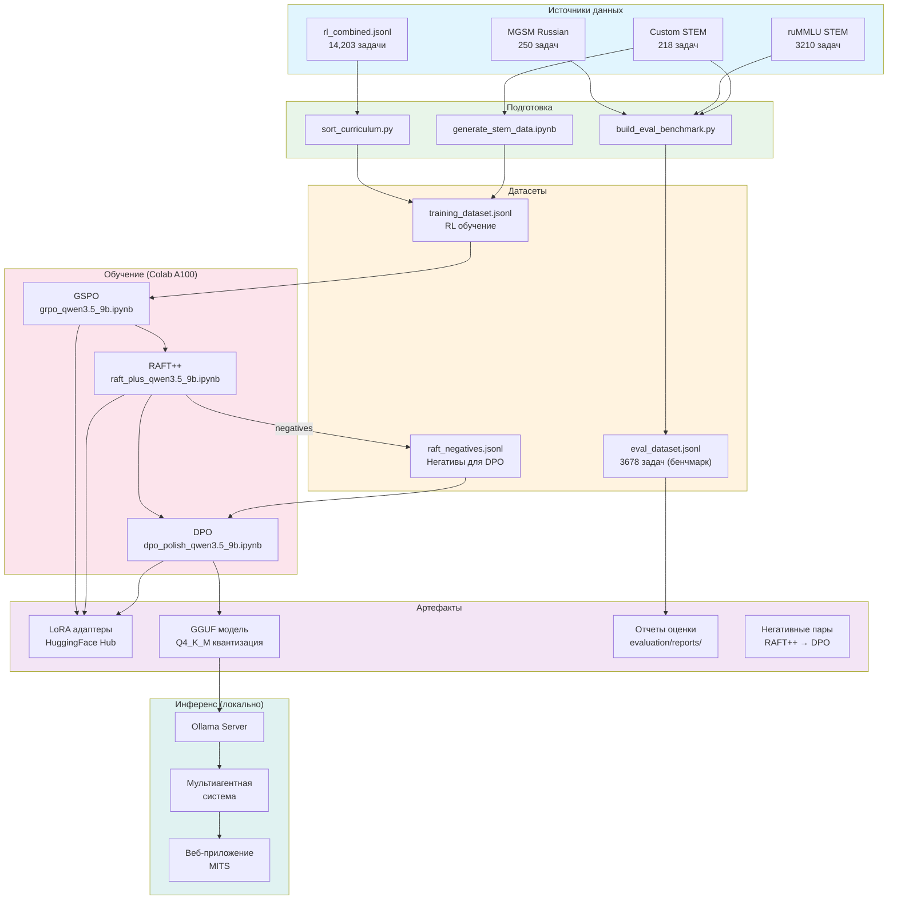
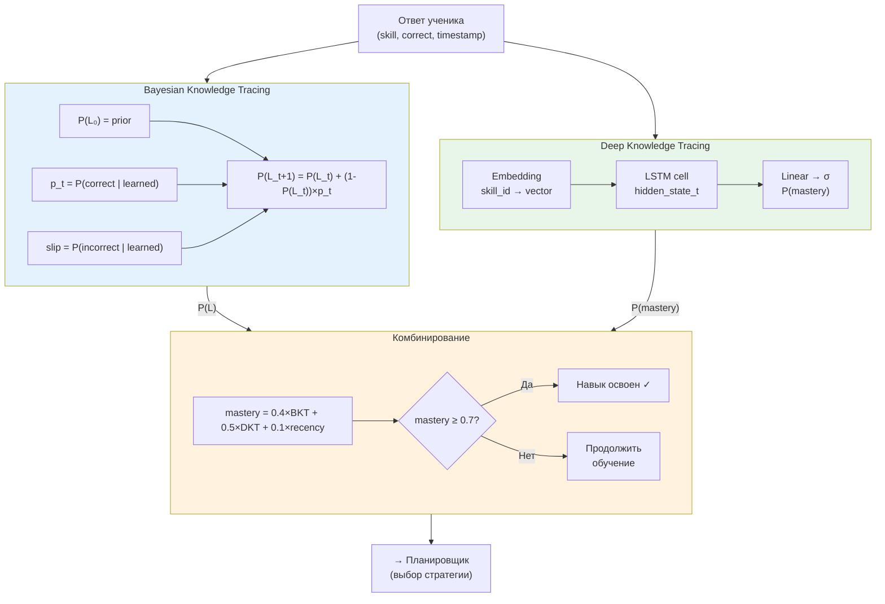
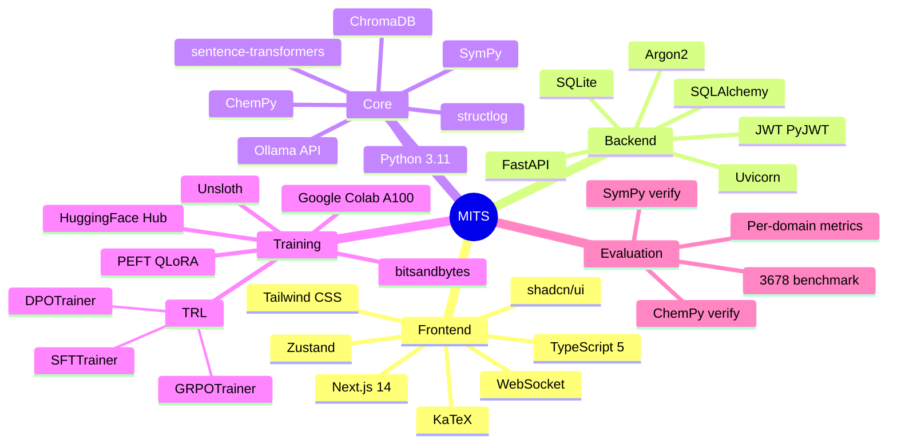
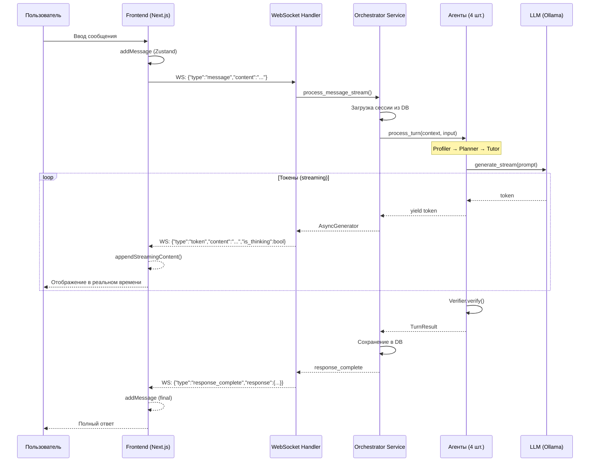

# MITS: Блок-схемы системы

Все диаграммы в формате Mermaid. Для рендеринга: VS Code (Mermaid Preview), GitHub, или [mermaid.live](https://mermaid.live).

---

## 1. Общая архитектура системы

---

## 2. Мультиагентный конвейер (детально)

---

## 3. Пайплайн обучения (3-Stage RL)

---

## 4. Поток данных (Data Flow)

---

## 5. Архитектура Knowledge Tracing

---

## 6. Стек технологий

---

## 7. Схема WebSocket-стриминга

