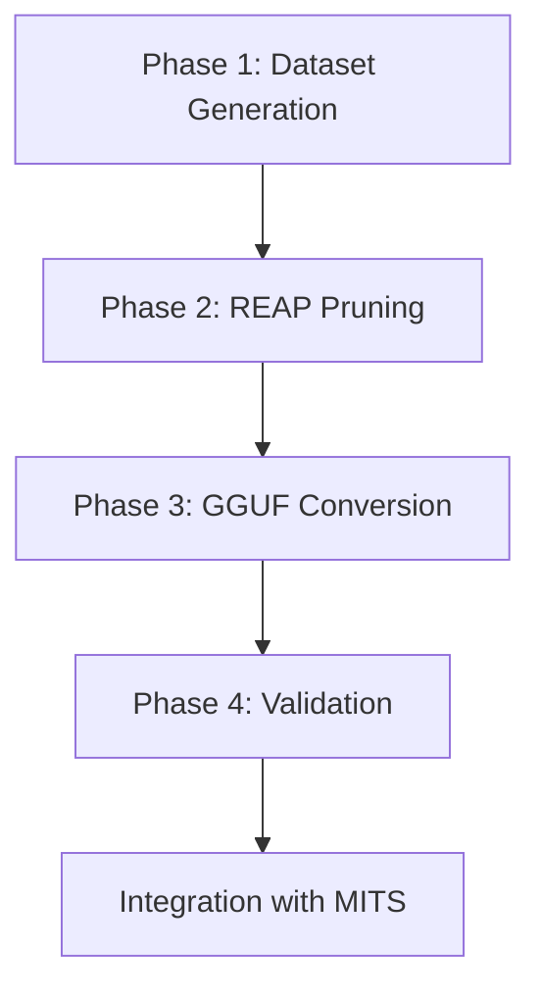

# Implementation Plan: GLM STEM Pruning

**Branch**: `003-glm-math-pruning` | **Date**: 2026-01-31 | **Spec**: [spec.md](./spec.md)
**Input**: Feature specification from `/specs/003-glm-math-pruning/spec.md`

## Summary

Create an optimized GLM-4.7-Flash variant for STEM tutoring by applying REAP expert pruning with a multi-domain calibration dataset generated via Cerebras API. The pruned model (~20B params) will be converted to GGUF for local Ollama deployment on RTX 2080 + 32GB RAM hardware.

## Technical Context

**Language/Version**: Python 3.11+
**Primary Dependencies**:
- cerebras-cloud-sdk (dataset generation)
- transformers, torch (model handling)
- REAP toolkit (expert pruning)
- llama.cpp (GGUF conversion)
**Storage**: Google Drive (checkpoints), local filesystem (GGUF)
**Testing**: pytest, lm-evaluation-harness (benchmarks)
**Target Platform**:
- Development: Google Colab A100 40GB
- Deployment: Windows 11, RTX 2080 8GB + 32GB RAM, Ollama
**Project Type**: Single project (ML pipeline + notebooks)
**Performance Goals**:
- TTFT < 3s on RTX 2080
- Generation >= 5 tokens/sec
- 95%+ quality retention across all STEM domains
**Constraints**:
- A100 compute budget: 100 CU (~1.6h A100 time)
- GGUF file size: < 12GB
- Ollama-compatible format
**Scale/Scope**: Single model optimization, 1000-sample calibration dataset

## Constitution Check

*GATE: Must pass before Phase 0 research. Re-check after Phase 1 design.*

| Principle | Status | Notes |
|-----------|--------|-------|
| I. Socratic Pedagogy | PASS | Calibration includes Socratic tutoring examples (15%) |
| II. Multi-Agent Architecture | N/A | Model optimization, not agent changes |
| III. Knowledge-Grounded | N/A | Model capability, not RAG changes |
| IV. Hardware Constraints | PASS | Target: RTX 2080 8GB + 32GB RAM with partial offload |
| V. Metrics-Driven | PASS | Validation on GSM8K, HumanEval, SciQ, MMLU-STEM |
| VI. STEM Domain Coverage | PASS | All 5 domains in calibration dataset |

**Gate Status**: PASS - All applicable principles satisfied.

## Project Structure

### Documentation (this feature)

```text
specs/003-glm-math-pruning/
├── spec.md              # Feature specification
├── plan.md              # This file
├── research.md          # Phase 0 output - technology decisions
├── data-model.md        # Phase 1 output - dataset schemas
├── quickstart.md        # Phase 1 output - setup instructions
├── contracts/           # Phase 1 output - API schemas
│   └── calibration-dataset-schema.json
└── tasks.md             # Phase 2 output (speckit.tasks)
```

### Source Code (repository root)

```text
notebooks/
└── glm_stem_pruning.ipynb    # Colab notebook for full pipeline

training/
├── generate_calibration.py   # Cerebras API dataset generation
├── prompts/                  # Domain-specific prompt templates
│   ├── code_prompts.json
│   ├── math_prompts.json
│   ├── physics_prompts.json
│   ├── chemistry_prompts.json
│   ├── biology_prompts.json
│   └── socratic_prompts.json
└── calibration_data/         # Generated calibration dataset
    └── stem_calibration.jsonl

evaluation/
├── benchmark_models.py       # Multi-domain benchmark runner
└── data/
    └── validation_samples/   # Quick validation samples

models/
└── glm-stem-pruned/         # Local model artifacts
    ├── Modelfile            # Ollama model definition
    └── README.md            # Model card
```

**Structure Decision**: Single project with notebooks for Colab execution and scripts for local validation. Model artifacts stored in `models/` for Ollama integration.

## Complexity Tracking

> No Constitution violations requiring justification.

| Item | Decision | Rationale |
|------|----------|-----------|
| External API (Cerebras) | Required | Local generation too slow, quality insufficient |
| Cloud compute (Colab A100) | Required | RTX 2080 insufficient for 30B model pruning |
| Multi-domain dataset | Required | Single-domain would prune essential experts |

## Implementation Phases

### Phase 1: Dataset Generation (Cerebras API)

**Goal**: Generate 1000 multi-domain STEM calibration examples

**Resources**: 10 API keys in `.env` (CEREBRAS_API_KEY_1..10)
- Effective rate: 300 req/min with rotation
- Free tier: $0.00 cost

**Components**:
1. Prompt templates for each domain (6 files)
2. Generation script with key rotation and rate limiting
3. Dataset validation and formatting
4. Checkpoint/resume support

**Output**: `training/calibration_data/stem_calibration.jsonl`
**Time**: ~15 minutes with key rotation

### Phase 2: REAP Pruning (Colab A100)

**Goal**: Prune GLM-4.7-Flash to ~20B parameters

**Components**:
1. Colab notebook with full pipeline
2. Checkpointing to Google Drive
3. Quick validation before export

**Output**: Pruned HuggingFace model on Drive

### Phase 3: GGUF Conversion

**Goal**: Convert pruned model to Ollama-compatible format

**Components**:
1. llama.cpp conversion script
2. Q4_K_M quantization
3. Ollama Modelfile

**Output**: `glm-stem-pruned-q4km.gguf` + `Modelfile`

### Phase 4: Validation

**Goal**: Verify quality across all STEM domains

**Components**:
1. Multi-benchmark evaluation script
2. Comparison with baseline GLM-4.7-Flash-REAP-23B
3. Performance testing on target hardware

**Output**: Benchmark report in `docs/MODEL_BENCHMARK_RESULTS.md`

## Risk Mitigation

| Risk | Mitigation |
|------|------------|
| Cerebras API rate limit | 10-key rotation (300 req/min effective), checkpoint progress |
| A100 OOM during pruning | Use gradient checkpointing, reduce batch size |
| GGUF conversion failure | Test with smaller pruning rate first |
| Quality regression in domain | Adjust pruning rate, add more domain examples |

## Dependencies


