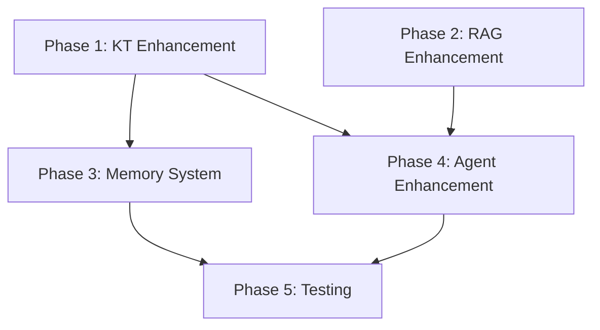

# Implementation Plan: MITS System Completion

**Branch**: `006-mits-system-completion` | **Date**: 2026-02-02 | **Spec**: [spec.md](./spec.md)
**Input**: Feature specification from `/specs/006-mits-system-completion/spec.md`

## Summary

Complete the MITS (Math Intelligent Tutoring System) by enhancing existing multi-agent architecture with improved Knowledge Tracing (DKT integration), RAG system optimization, cognitive load estimation, and dual-memory personalization. The system already has a solid foundation with 6 working agents, BKT, and RAG - this plan focuses on completing and optimizing these components based on 2025-2026 research (RL-DKT, GraphRAG, SocraticLLM).

## Technical Context

**Language/Version**: Python 3.11+
**Primary Dependencies**: Ollama, Gradio 4.x, ChromaDB, sentence-transformers, pydantic, structlog, LangChain
**Storage**: SQLite (student profiles, metrics), ChromaDB (RAG vectors), JSON (configs, task banks)
**Testing**: pytest, pytest-timeout
**Target Platform**: Windows/Linux desktop with RTX 2080 8GB (or equivalent)
**Project Type**: Single project (monorepo)
**Performance Goals**: <5s hint delivery, 50 concurrent sessions, 75% KT accuracy
**Constraints**: <6GB VRAM, offline-capable (Ollama local), Russian language support
**Scale/Scope**: ~100 topics, ~500 tasks, ~1000 hints/misconceptions

## Constitution Check

*GATE: Must pass before Phase 0 research. Re-check after Phase 1 design.*

| Principle | Status | Evidence |
|-----------|--------|----------|
| I. Socratic Pedagogy | ✅ PASS | FR-011 to FR-014 enforce guiding questions, Telling@10 <15% tracked |
| II. Multi-Agent Architecture | ✅ PASS | 6 agents already implemented (Orchestrator, Profiler, Planner, Tutor, Verifier, TaskGen) |
| III. Knowledge-Grounded Responses | ✅ PASS | FR-006 to FR-010 mandate RAG grounding, existing rag_retriever.py |
| IV. Hardware Constraint Compliance | ✅ PASS | GLM-4.7-Flash 3B active params, config.py GPU_LAYERS=25 |
| V. Metrics-Driven Quality | ✅ PASS | SC-001 to SC-010 define measurable outcomes, metrics.py exists |
| VI. STEM Domain Coverage | ⚠️ PARTIAL | Math+Programming complete, Physics/Chemistry/Biology need knowledge base |

**Note**: STEM coverage (VI) will be addressed in knowledge base population phase.

## Project Structure

### Documentation (this feature)

```text
specs/006-mits-system-completion/
├── plan.md              # This file
├── research.md          # Phase 0 output
├── data-model.md        # Phase 1 output
├── quickstart.md        # Phase 1 output
├── contracts/           # Phase 1 output
└── tasks.md             # Phase 2 output
```

### Source Code (repository root)

```text
src/
├── agents/
│   ├── base_agent.py        # ✅ Complete - abstract base
│   ├── tutor_agent.py       # ✅ Complete - Socratic tutoring
│   ├── task_generator.py    # ✅ Complete - adaptive task generation
│   ├── profiler.py          # ✅ Complete - error diagnosis
│   ├── planner.py           # ✅ Complete - strategy selection
│   ├── verifier.py          # ✅ Complete - quality control
│   └── orchestrator.py      # ✅ Complete - agent coordination
├── data/
│   ├── schemas.py           # ✅ Complete - Pydantic models
│   ├── task_bank.py         # ✅ Complete - math tasks
│   └── algo_task_bank.py    # ✅ Complete - algo tasks
├── execution/
│   ├── code_executor.py     # ✅ Complete - sandboxed execution
│   └── code_analyzer.py     # ✅ Complete - AST analysis
├── inference/
│   ├── model_manager.py     # ✅ Complete - multi-backend
│   ├── cache.py             # ✅ Complete - response caching
│   └── metrics.py           # ✅ Complete - performance tracking
├── knowledge/
│   ├── rag_retriever.py     # 🔧 Enhance - add re-ranking, context awareness
│   └── tracer.py            # 🔧 Enhance - add DKT, cognitive load
├── models/
│   ├── llm_client.py        # ✅ Complete - Ollama integration
│   ├── knowledge_tracing.py # 🔧 Enhance - add DKT model
│   └── prompts.py           # ✅ Complete - Russian prompts
├── memory/                  # 🆕 NEW - dual-memory system
│   ├── session_memory.py    # Short-term context
│   └── student_memory.py    # Long-term persistence
├── utils/
│   └── session_logger.py    # ✅ Complete - logging
└── config.py                # ✅ Complete - settings

interface/
├── unified_app.py           # ✅ Complete - main app
└── ... (other apps)

tests/
├── test_coding.py           # ✅ Complete
├── test_glm_stem.py         # ✅ Complete
├── test_knowledge_tracing.py # 🆕 NEW - DKT tests
└── test_memory.py           # 🆕 NEW - memory tests

data/
├── knowledge/
│   ├── hints/               # 🔧 Populate - structured hints
│   ├── misconceptions/      # 🔧 Populate - common errors
│   └── skill_graph.json     # 🔧 Expand - prerequisites
├── students/                # ✅ Ready - profile storage
└── chromadb/                # ✅ Ready - vector DB
```

**Structure Decision**: Single project structure maintained. New `src/memory/` module added for dual-memory system. Existing modules enhanced rather than replaced.

## Complexity Tracking

| Violation | Why Needed | Simpler Alternative Rejected Because |
|-----------|------------|-------------------------------------|
| DKT model addition | BKT insufficient for complex learning patterns after 10+ interactions | BKT alone cannot model skill dependencies and temporal patterns |
| Dual-memory system | Session + long-term memory required for personalization | Single storage doesn't differentiate session context vs. persistent data |

## Implementation Phases

### Phase 1: Knowledge Tracing Enhancement (P1)
- Extend `knowledge_tracing.py` with DKT model option
- Add cognitive load estimation based on response time + error patterns
- Implement BKT→DKT transition logic (threshold: 10 responses)
- Update Profiler agent to use enhanced KT

### Phase 2: RAG System Enhancement (P2)
- Add context-aware re-ranking to `rag_retriever.py`
- Implement topic-specific hint retrieval
- Add misconception detection and retrieval
- Populate knowledge base with structured content

### Phase 3: Dual-Memory System (P3)
- Create `src/memory/session_memory.py` for conversation context
- Create `src/memory/student_memory.py` for persistent profiles
- Integrate with Orchestrator for context injection
- Add knowledge decay model for long-term memory

### Phase 4: Agent Enhancement (P2)
- Update Tutor agent with improved Socratic prompts
- Enhance Verifier with stricter quality checks
- Add cognitive load signals to Planner strategy selection
- Update TaskGenerator for adaptive difficulty

### Phase 5: Testing & Validation (P1)
- Write comprehensive tests for new components
- Run evaluation against Success Criteria metrics
- Performance testing for concurrent sessions
- Russian language validation

## Dependencies



## Risk Mitigation

| Risk | Mitigation |
|------|------------|
| DKT model too large for 8GB VRAM | Use lightweight RNN-based DKT, not transformer |
| RAG retrieval latency | Pre-compute embeddings, use efficient ANN index |
| Memory persistence failures | SQLite with WAL mode, graceful degradation |
| Russian language quality | Test with native speakers, use GLM's multilingual capability |
